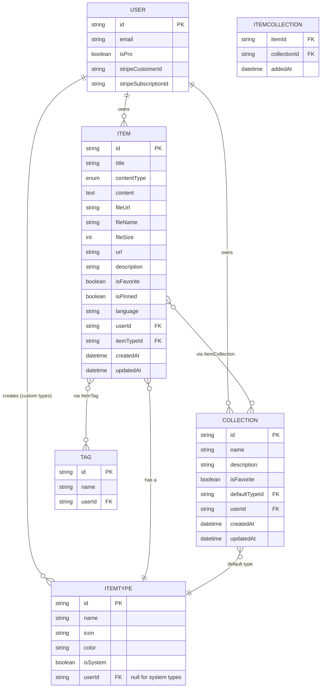
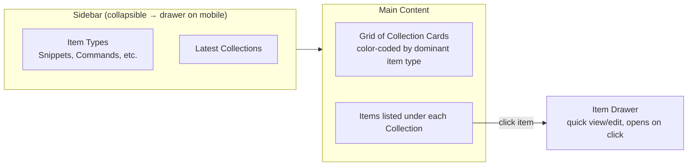

# DevStash — Project Overview

> One fast, searchable, AI-enhanced hub for all your dev knowledge & resources.

---

## 1. Problem

Developers keep their essentials scattered across too many tools:

- Code snippets in VS Code or Notion
- AI prompts buried in old chat threads
- Context files lost in random project folders
- Useful links in browser bookmarks
- Docs in random folders
- Commands saved in `.txt` files
- Project templates in GitHub Gists
- One-off terminal commands lost to bash history

The result: constant context-switching, lost knowledge, and inconsistent workflows.

**DevStash solves this** with a single, fast, searchable, AI-enhanced hub for snippets, prompts, notes, commands, files, images, and links.

---

## 2. Target Users

| User | Core Need |
|---|---|
| **Everyday Developer** | Fast capture/retrieval of snippets, prompts, commands, links |
| **AI-first Developer** | A home for prompts, contexts, workflows, system messages |
| **Content Creator / Educator** | Storing code blocks, explanations, course notes |
| **Full-Stack Builder** | Collecting patterns, boilerplates, API examples |

---

## 3. Core Features

### A. Items & Item Types

Every piece of saved knowledge is an **Item**. Items have a **type**, which determines how content is stored and displayed.

Users can create **custom types** later (Pro feature, post-launch). At launch, these **system types** are fixed and cannot be edited or deleted by users:

| Type | Storage Shape | Tier |
|---|---|---|
| `snippet` | text | Free |
| `prompt` | text | Free |
| `note` | text | Free |
| `command` | text | Free |
| `link` | url | Free |
| `file` | file | Pro only |
| `image` | file | Pro only |

Items should be quick to create and access via a **slide-out drawer**, not a full page navigation.

> **Note on original spec:** the source notes listed item `contentType` as `text | file` only, but three distinct storage shapes are actually needed: `text`, `url`, and `file`. The schema below reflects this three-way split so `link` items aren't forced to awkwardly reuse the `file` shape.

### B. Collections

- Collections group items of **any type** together (mixed-type collections are expected, not an edge case).
- An item can belong to **multiple collections** simultaneously (e.g., a React snippet in both "React Patterns" and "Interview Prep").
- Example collections: *React Patterns* (snippets, notes), *Context Files* (files), *Python Snippets* (snippets).

### C. Search

Unified search across:
- Content body
- Tags
- Titles
- Item type

### D. Authentication

- Email/password
- GitHub OAuth
- Powered by **NextAuth v5**

### E. Other Features

- Favorite items and collections
- Pin items to top
- "Recently used" view
- Import code from a file
- Markdown editor for text-based types
- File upload for `file` / `image` types
- Export data (multiple formats)
- Dark mode (default), light mode optional
- Add/remove an item to/from multiple collections
- View which collections a given item belongs to

### F. AI Features (Pro only)

- AI auto-tag suggestions
- AI summaries
- "Explain This Code"
- AI prompt optimizer

---

## 4. Data Model

### Entity Relationship Diagram



### Prisma Schema

Reflects the tech stack decision: **Prisma 7**, PostgreSQL via **Neon**, migrations-only workflow (no `db push`).

```prisma
// schema.prisma
generator client {
  provider = "prisma-client-js"
}

datasource db {
  provider = "postgresql"
  url      = env("DATABASE_URL")
}

// ---------- Enums ----------

enum ContentType {
  TEXT
  URL
  FILE
}

// ---------- Auth (NextAuth v5) ----------

model User {
  id                   String   @id @default(cuid())
  name                 String?
  email                String   @unique
  emailVerified        DateTime?
  image                String?

  // Billing
  isPro                Boolean  @default(false)
  stripeCustomerId     String?  @unique
  stripeSubscriptionId String?  @unique

  // Relations
  accounts             Account[]
  sessions             Session[]
  items                Item[]
  collections          Collection[]
  itemTypes            ItemType[]
  tags                 Tag[]

  createdAt            DateTime @default(now())
  updatedAt            DateTime @updatedAt
}

model Account {
  id                String  @id @default(cuid())
  userId            String
  type              String
  provider          String
  providerAccountId String
  refresh_token     String? @db.Text
  access_token      String? @db.Text
  expires_at        Int?
  token_type        String?
  scope             String?
  id_token          String? @db.Text
  session_state     String?

  user User @relation(fields: [userId], references: [id], onDelete: Cascade)

  @@unique([provider, providerAccountId])
}

model Session {
  id           String   @id @default(cuid())
  sessionToken String   @unique
  userId       String
  expires      DateTime

  user User @relation(fields: [userId], references: [id], onDelete: Cascade)
}

// ---------- Core Domain ----------

model Item {
  id          String      @id @default(cuid())
  title       String
  contentType ContentType

  // Populated depending on contentType
  content     String?     @db.Text  // snippet/prompt/note/command markdown
  url         String?                // link items
  fileUrl     String?                // R2 object URL (file/image)
  fileName    String?
  fileSize    Int?

  description String?
  language    String?     // optional syntax highlighting hint for code
  isFavorite  Boolean     @default(false)
  isPinned    Boolean     @default(false)

  userId      String
  user        User        @relation(fields: [userId], references: [id], onDelete: Cascade)

  itemTypeId  String
  itemType    ItemType    @relation(fields: [itemTypeId], references: [id])

  collections ItemCollection[]
  tags        ItemTag[]

  createdAt   DateTime    @default(now())
  updatedAt   DateTime    @updatedAt

  @@index([userId])
  @@index([itemTypeId])
  @@index([userId, isFavorite])
  @@index([userId, isPinned])
}

model ItemType {
  id        String   @id @default(cuid())
  name      String
  icon      String
  color     String
  isSystem  Boolean  @default(false)

  // null for system types (shared across all users)
  userId    String?
  user      User?    @relation(fields: [userId], references: [id], onDelete: Cascade)

  items       Item[]
  collections Collection[] @relation("DefaultType")

  createdAt DateTime @default(now())

  @@unique([userId, name])
}

model Collection {
  id            String   @id @default(cuid())
  name          String
  description   String?
  isFavorite    Boolean  @default(false)

  defaultTypeId String?
  defaultType   ItemType? @relation("DefaultType", fields: [defaultTypeId], references: [id])

  userId        String
  user          User     @relation(fields: [userId], references: [id], onDelete: Cascade)

  items         ItemCollection[]

  createdAt     DateTime @default(now())
  updatedAt     DateTime @updatedAt

  @@index([userId])
}

model ItemCollection {
  itemId       String
  item         Item       @relation(fields: [itemId], references: [id], onDelete: Cascade)

  collectionId String
  collection   Collection @relation(fields: [collectionId], references: [id], onDelete: Cascade)

  addedAt      DateTime   @default(now())

  @@id([itemId, collectionId])
  @@index([collectionId])
}

model Tag {
  id     String @id @default(cuid())
  name   String

  userId String
  user   User   @relation(fields: [userId], references: [id], onDelete: Cascade)

  items  ItemTag[]

  @@unique([userId, name])
}

model ItemTag {
  itemId String
  item   Item   @relation(fields: [itemId], references: [id], onDelete: Cascade)

  tagId  String
  tag    Tag    @relation(fields: [tagId], references: [id], onDelete: Cascade)

  @@id([itemId, tagId])
  @@index([tagId])
}
```

**Schema notes / deviations from original spec:**
- Added `Account` and `Session` models — required boilerplate for NextAuth v5, missing from the original data sketch.
- Split `contentType` into a `ContentType` enum (`TEXT | URL | FILE`) instead of `text | file`, so `link` items have a proper home.
- Made `Tag` scoped per-user (`@@unique([userId, name])`) — the original spec didn't say, but a global tag namespace shared across all users would leak naming collisions and let one user's tags clutter another's search. Worth confirming this is the intended behavior.
- Added indexes on foreign keys and common filter patterns (`isFavorite`, `isPinned`) since these will be hit on nearly every dashboard load.
- Per your instructions: **migrations only**, never `prisma db push`, in both dev and prod.

---

## 5. Tech Stack

| Layer | Choice |
|---|---|
| Framework | Next.js 16 / React 19 (SSR pages, dynamic components) |
| API | Next.js API routes (items, file uploads, AI calls) |
| Language | TypeScript |
| Database | Neon (PostgreSQL, serverless) |
| ORM | Prisma 7 — **migrations only, never `db push`** |
| Caching | Redis (maybe — deferred decision) |
| File Storage | Cloudflare R2 |
| Auth | NextAuth v5 (email/password + GitHub OAuth) |
| AI | OpenAI `gpt-5-nano` |
| Styling | Tailwind CSS v4 + shadcn/ui |
| Repo structure | Single codebase / monorepo-free for lower overhead |

> **Flag:** Prisma 7 and the `gpt-5-nano` model name should be confirmed against current docs before you lock the stack — worth a quick check right before you scaffold the project, since these move fast and this doc will age.

---

## 6. Monetization

Freemium model.

### Free Tier
- 50 items total
- 3 collections
- All system types **except** file/image
- Basic search
- No file/image uploads
- No AI features

### Pro Tier — $8/mo or $72/yr
- Unlimited items
- Unlimited collections
- File & image uploads
- Custom types *(post-launch)*
- AI auto-tagging
- AI code explanation
- AI prompt optimizer
- Data export (JSON/ZIP)
- Priority support

> **Development note:** Build the Pro/free gating foundation now (flags, checks, Stripe fields), but **leave every feature unlocked for all users during development**. Gate at launch, not before.

---

## 7. UI / UX

### General Direction
- Modern, minimal, developer-focused
- Dark mode by default; light mode optional
- Clean typography, generous whitespace
- Subtle borders and shadows
- Visual references: **Notion**, **Linear**, **Raycast**
- Syntax highlighting on all code blocks

### Layout



- **Sidebar:** item type shortcuts + list of recent collections.
- **Main:** grid of collection cards, background-tinted by whichever item type dominates that collection; items nest under their collection with border coloring by type.
- **Item detail:** opens in a quick-access drawer, not a separate page.

### Type Colors & Icons

| Type | Color | Hex | Icon (lucide-react) |
|---|---|---|---|
| Snippet | 🔵 Blue | `#3b82f6` | `Code` |
| Prompt | 🟣 Purple | `#8b5cf6` | `Sparkles` |
| Command | 🟠 Orange | `#f97316` | `Terminal` |
| Note | 🟡 Yellow | `#fde047` | `StickyNote` |
| File | ⚪ Gray | `#6b7280` | `File` |
| Image | 🌸 Pink | `#ec4899` | `Image` |
| Link | 🟢 Emerald | `#10b981` | `Link` |

### Responsive Behavior
- Desktop-first, mobile-usable
- Sidebar collapses into a drawer on mobile

### Micro-interactions
- Smooth transitions throughout
- Hover states on all cards
- Toast notifications for user actions
- Loading skeletons instead of spinners

---

## 8. Open Questions / Things to Resolve Before Build

1. **Redis caching** — "maybe." Worth deciding now since it affects the API route architecture, or explicitly deferring to a post-launch performance pass.
2. **Custom item types** — spec says Pro-only, "later." Confirm whether the `ItemType` schema above (already supporting user-owned types) is sufficient groundwork, or if it needs more constraints (e.g., a cap on custom types per Pro user).
3. **Tag scoping** — confirm per-user tags (as modeled above) vs. a shared/global tag pool.
4. **Collection naming inconsistency** — the original notes use both "React Hooks" and "React Patterns" as examples in different sections; not a functional issue, just flagging so example copy in the actual UI is consistent.
5. **`gpt-5-nano` and Prisma 7** — confirm exact model/version identifiers against current documentation at scaffold time, not against this doc.
6. **Export formats** — spec mentions "different formats" generally, then "JSON/ZIP" specifically under Pro. Worth locking down the full list (JSON, Markdown, CSV?) upfront.

---

*Original planning notes cleaned up and structured — see inline notes above for every point where this doc deviates from or clarifies the source spec.*
